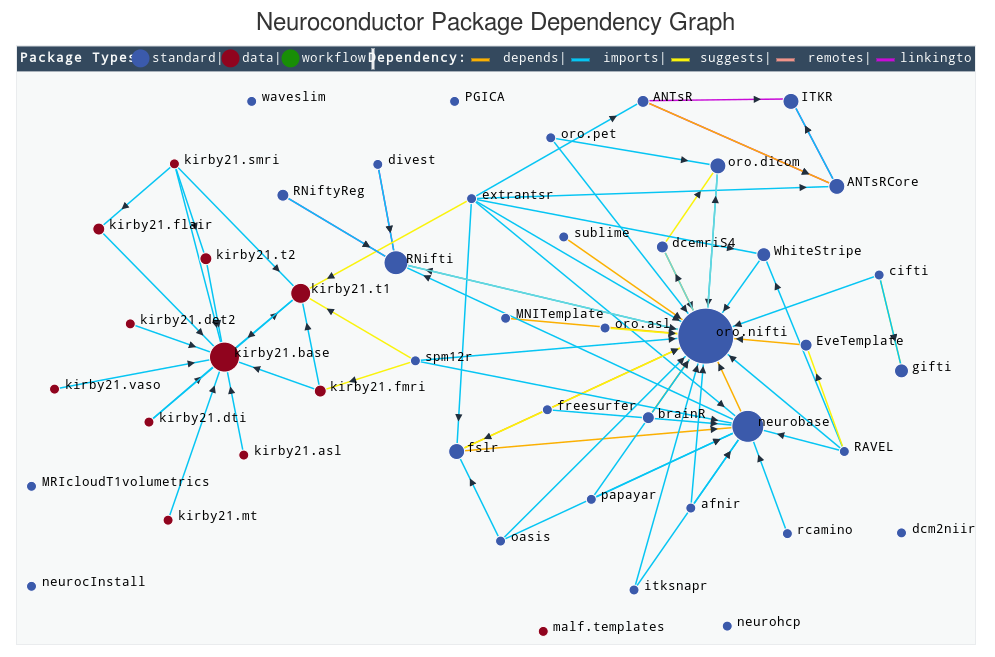

```{r setup, include=FALSE}
knitr::opts_chunk$set(eval = FALSE)
```

---

## The world at large

https://neuroconductor.org



## RMINC

We're going to focus on RMINC, although many of the principles will be applicable to other packages

---

## Data

- Alzheimer's Disease Neuroimaging Initative Data
- Large open data-set of healthy controls and participants with Alzheimer's disease
- We're going to be working with a small excerpt

## Open R

```{r}
library(RMINC)
library(dplyr)
library(ggjoy)
```

Or for those who don't like clogging your terminal

```{r}
suppressPackageStartupMessages({
  library(RMINC)
  library(dplyr)
  library(ggjoy)
})
```

## Data ingest

Let's bring in a prepared meta-data sheet for our excerpt

```{r}
civet_dir <- "~/civet-course/civet-course" #"/scinet/course/ss2017/19_mrir/civet-course/" 
adni <- read.csv(file.path(civet_dir, "civet_ADNI.csv"))
```

Let's have a look at the data

```{r}
summary(adni)
```

Hmm, what's this CIVETQC column?

```{r}
adni$CIVETQC
```

Looks like a binary measure indicating if subjects passed QC

```{r}
## Filter QC fails
adni <- adni[adni$CIVETQC != 0, ]

#who's left over
summary(adni)
```


```{r}
## Tabulate of demographics
table(adni$Gender, adni$DX_bl)

## visualize age distributions

#boxplot
boxplot(Age ~ Gender + DX_bl, data = adni)

#joyplot
adni %>%
    mutate(sxd =
               factor(paste(DX_bl, Gender)
                      , levels = c("CN Male"
                                 , "AD Male"
                                 , "CN Female"
                                 , "AD Female"))) %>%
    ggplot(aes(x = Age, y = sxd)) +
    geom_joy()
```

## Neuroanatomy

Take a first look at a subject's cortex

```{r}
example_left_surf <-
    file.path(civet_dir, "output/002_S_0559/surfaces/ADNI_002_S_0559_mid_surface_rsl_left_81920.obj") %>%
    read_obj()

plot(example_left_surf)
```

Now let's colour by thickness

```{r}
example_thickness <-
    file.path(civet_dir, "output/002_S_0559/thickness/ADNI_002_S_0559_native_rms_rsl_tlink_28.28mm_left.txt")

plot(example_left_surf, colour_map = example_thickness, symmetric = TRUE)
```

## Let's thicknesses for all subjects

```{r}
mean_surface <- read_obj(file.path(civet_dir, "lh_average.obj"))
thickness <- sprintf("%s/output/%s/thickness/ADNI_%s_native_rms_rsl_tlink_28.28mm_left.txt"
                   , civet_dir
                   , adni$ID
                   , adni$ID)

## Check files were found ok
stopifnot(all(file.exists(thickness)))
## Add these to the adni data.frame
adni$thickness <- thickness
```

## Vertex Mean

Let's compute the mean thickness across all our subjects

```{r}
mean_thickness <- vertexMean(adni$thickness)
plot(mean_surface, mean_thickness)
```

## Simple T-test

Recall R's simple linear model command

```{r}
lm(y ~ x, data = d)
```

RMINC has equivalents that operate on vectors of files

```{r}
## Note thickness is a character vector column
vlm <- vertexLm(thickness ~ DX_bl, data = adni)
```

Inspect the resulting vlm object

```{r}
str(vlm)

colnames(vlm)
```

Lets convince ourselves this gives the same answer as good old
fashioned `lm`

```{r}
vt <- vertexTable(adni$thickness)
first_voxel <- vt[1,]

mod <- lm(first_voxel ~ DX_bl, data = adni)

summary(mod)
```

As you can see the difference reported by t-test is the same as
the intercept free linear model.

Let's look at the pattern of cortical differences

```{r}
plot(mean_surface, vlm[,"beta-DX_blCN"])
```

## A more interesting model

Let's include some covariate information and an intercept term

```{r}
vlm <- vertexLm(thickness ~ DX_bl + Gender + Age, data = adni)
```

This time we're interested in the significance of the the
result. So we use False Discovery Rate control to limit
our expected number of false positives.

```{r}
vfdr <- vertexFDR(vlm)

vfdr
```

This prints a handy table of a few potentially interesting thresholds
and the minimum (absolute) t-statistics required to achieve the desired
FDR. These can be accessed programmatically

```{r}
age_thresh <- thresholds(vfdr)["0.05", "tvalue-Age"]
```

And we can threshold our statistic maps to these levels

```{r}
plot(mean_surface, vlm[,"tvalue-Age"]
   , colour_range = c(age_thresh, max(abs(vlm[,"tvalue-Age"])))
   , symmetric = TRUE)
```

Looks like a small area in the left auditory cortex is thinning with age

## Where's that effect

Let's check to see if that is indeed the auditory cortex
We'll use the AAL atlas

```{r}
aal_left <- readLines(file.path(civet_dir, "AAL_atlas_left.txt"))
aal_key <- read.csv(file.path(civet_dir, "AAL_key.csv"))
```

Let's find the signal peaks from the thresholded age t-values

```{r}
peaks <-
    vertexFindPeaks(vlm[,"tvalue-Age"], obj_to_graph(mean_surface), threshold = age_thresh
                  , output = "indices")

plot(mean_surface, vlm[,"tvalue-Age"]
   , colour_range = c(age_thresh, max(abs(vlm[,"tvalue-Age"])))
   , symmetric = TRUE)

rgl::spheres3d(t(mean_surface$vertex_matrix[,peaks]), radius = 10)
```

And where are these in the AAL

```{r}
peak_regions <- aal_left[peaks]

aal_key[aal_key$code %in% peak_regions,]
```

## Picking a good model

Perhaps we aren't confident we modelled age correctly.
A helpful tool in this case is model selection.

Lets find out if thickness should be a
linear, quadratic, or cubic function of age.

```{r}
vlm1 <- vertexLm(thickness ~ DX_bl + Gender + Age, data = adni)
vlm2 <- vertexLm(thickness ~ DX_bl + Gender + poly(Age, 2), data = adni)
vlm3 <- vertexLm(thickness ~ DX_bl + Gender + poly(Age, 3), data = adni)
```

We can easily get vertex-wise AIC for each model

```{r}
criteria <-  compare_models(vlm1, vlm2, vlm3, metric = AICc)
summary(criteria)
```

And we observe that linear age is the most parsimonious explanation for
the age related cortical thickness changes across the cortex.

## Randomization inference

Since we've now used a statistical criterion to choose our model
traditional inference is inappropriate. A randomization test is now
more appropriate than FDR

```{r}
randomization_distribution <-
    RMINC:::vertexRandomize.vertexLm(vlm1, parallel = c("local", 6))

rd_thresholds <-
    RMINC:::thresholds.minc_randomization(randomization_distribution)
```

Let's determine how many vertices are above our diagnosis 5% randomization
threshold relative to the FDR thresholds

```{r}
## FDR
sum(abs(vlm1[,"tvalue-DX_blCN"]) > thresholds(vfdr)["0.05", "tvalue-DX_blCN"])
## Randomization
sum(abs(vlm1[,"tvalue-DX_blCN"]) > rd_thresholds["5%", "tvalue-DX_blCN"])
```

Compare effect maps

```{r}
plot(mean_surface, vlm1[,"tvalue-DX_blCN"]
   , colour_range = c(thresholds(vfdr)["0.05", "tvalue-DX_blCN"]
                    , max(abs(vlm1[,"tvalue-DX_blCN"])))
     , symmetric = TRUE)


plot(mean_surface, vlm1[,"tvalue-DX_blCN"]
   , colour_range = c(rd_thresholds["5%", "tvalue-DX_blCN"]
                    , max(abs(vlm1[,"tvalue-DX_blCN"])))
   , symmetric = TRUE)
```


## Threshold Free Cluster Enhancement

Following the intuition that we're more confident in large regions of
contiguous effect, Nichols et al. introduced Threshold Free Cluster Enhancement
(TFCE).

TFCE is computed as $$ \int h^H e(h)^H dh $$ where h is the threshold
e is the extent of the cluster at threshold h, H and E are 2 and 0.5 respectively.

```{r}
get_adjacency <-
    function(g) lapply(.Call(igraph:::C_R_igraph_get_adjlist, g, 3), `+`, 1)

mean_surf_graph <- obj_to_graph(mean_surface)

enhanced_dxt <- vertexTFCE(vlm1[,"tvalue-DX_blCN"]
                         , get_adjacency(mean_surf_graph))

plot(mean_surface, enhanced_dxt, symmetric = TRUE)

plot(mean_surface, vlm1[,"tvalue-DX_blCN"], symmetric = TRUE)
```

## Taking your data off road

Let's try to do some things that aren't available simply in
RMINC.

Let's see if there is a variance difference between the controls and AD patients
at each vertex. We can use a levene's test for this. We'll need the `car` package

```{r}
library(car)
```

We'll want a wrapper function that just returns what we're interested. 40,000
R objects can get quite large if you're not careful

```{r}
levene_F_and_P <-
    function(v) leveneTest(v, adni$DX_bl)[1,2:3]

levene_res <- vertexApply(adni$thickness, levene_F_and_P)
```

Often the analysis you want to perform can't be performed
independently on each voxel. In this case you can bring
the full complement of R tools to bear at the expense of
speed.

```{r}
vt <- vertexTable(adni$thickness)
```

In this form your thickness data is the same as any R matrix

Maybe we are interested in clustering voxels:

```{r}
vertex_clusters <- kmeans(vt, centers = 10)
```

Now let's look at clusters of vertices with similar thicknesses
across subjects

```{r}
plot(mean_surface, colour_map = vertex_clusters$cluster
   , palette = rainbow(14)[1:10])
```

## Mixed Effects

RMINC offers abilities to do mixed effects models as well

As a simple example lets pretend sex is a random effect

```{r}
vlmer <- vertexLmer(thickness ~ Age + DX_bl + (1 | Gender)
                  , data = adni
                  , parallel = c("local", 6)))
```

Lets estimate degrees of freedom with Satterthwaite's Approximation

```{r}
vlmer <- vertexLmerEstimateDF(vlmer)

vertexFDR(vlmer)
```


