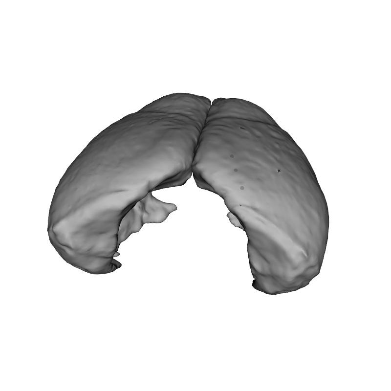

Visualizing 3D Objects with RMINC
==================================

As of RMINC 1.3 we've begun to support visualizing 3D volumes with R. 
This document is designed to showcase a few of these features.

```{R}
#Load in our libraries
library(RMINC)
library(rgl)
```
```{R, echo = FALSE}
setupKnitr()
```

Lets pull in a demonstration object file. The file format currently supported by RMINC is the BIC-MNI text obj format, documented [on their github](https://github.com/BIC-MNI/bicpl/Documentation). This file format is used by CIVET, amongst other tools, to store brain surfaces. The figures produced are interactive and can be rotated and magnified with the mouse.

```{R, rgl = TRUE}
mouse_cortex <- 
  read_obj("/axiom2/projects/software/cortical-thickness/MWM/c57bl6_laplacian_grid_full_surface_simplified.obj")

plot(mouse_cortex)
```

In addition to creating surfaces, it is possible to add thresholdable statistics maps with colour legends

```{R, rgl = TRUE}
demo_stats <- #Generate some random uniform vertex data
  runif(ncol(mouse_cortex$vertex_matrix))

plot(mouse_cortex, demo_stats, colour_range = c(.5,1))
```

It is also possible to identify vertices from a figure

```{R, eval = FALSE}
selected_vertices <- vertexSelect(multiples = TRUE)
```
```{R, echo = FALSE}
selected_vertices <- 
  matrix(c(1.29478, -1.22361, 3.57911,
           1.49924, -1.86518, 3.39112,
           1.79532, -2.49190, 3.08894), 
         ncol = 3, byrow = TRUE)
```



To disable the indicator spheres, simply run `vertexSelect` with `indicate = FALSE`. To remove the spheres after you've verified they are correct, run `rgl::pop3d()`, only do this if you have not added elements to the rgl scene after the spheres, otherwise you will need to look up their ids with `rgl::ids()`. See `?vertexSelect` for details.

Once you've identified your vertices of interest, you can find those vertices within the statistic map

```{R}
vertexLookup(mouse_cortex, selected_vertices, demo_stats)
```


